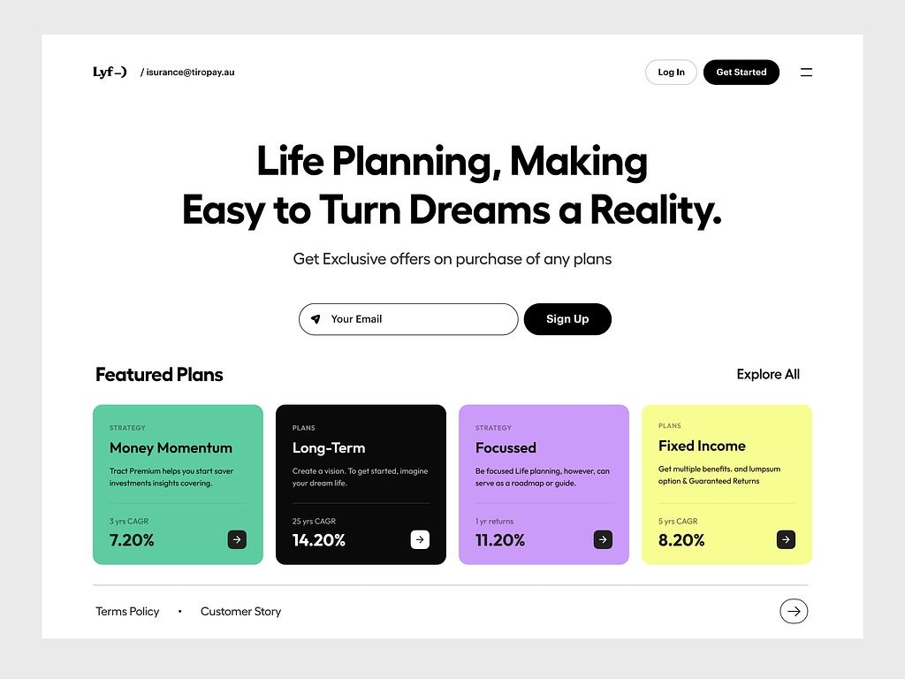
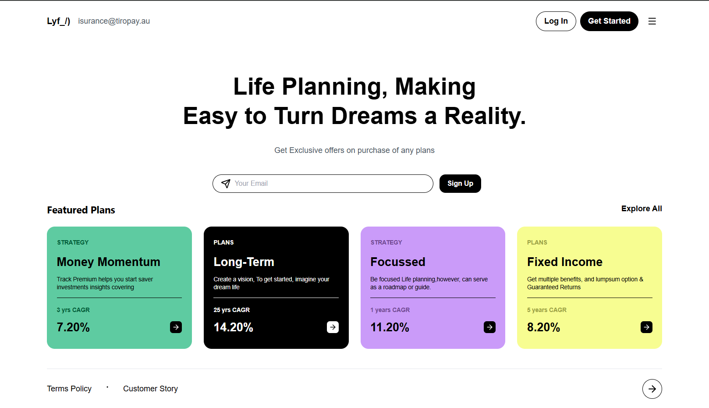
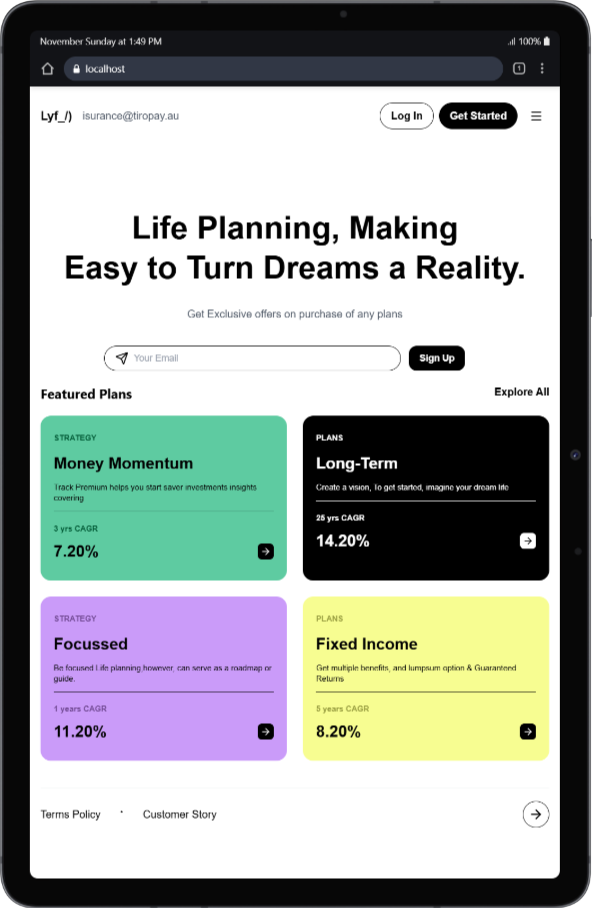
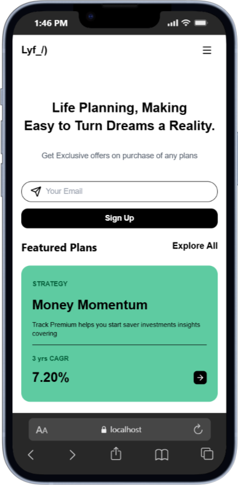
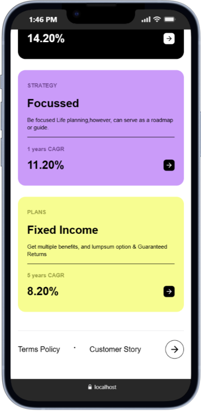

# Homepage UI Practice ✨

A little homepage UI built using React, Vite, Tailwind and Lucide React Icons.  
Doing this to practice UI layout, styling, and making things responsive — and to show that I can turn a visual design into code.

---

## 📸 Screenshots

### Reference Design

### My Version

**Desktop:**  

**Tablet:**  

**Mobile:**  
  
  

---

## Tech Stack

- React + Vite
- Tailwind CSS
- Lucide React Icons
